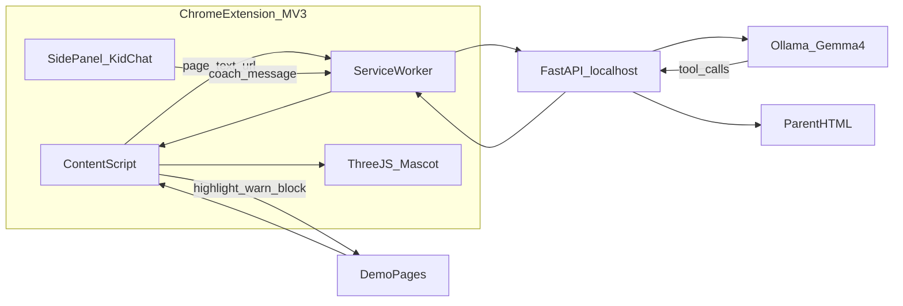

# KidGuard — Extension + 3D Mascot Plan (Team of 4)

**Deadline:** 18:00 today  
**Track:** Autonomous Agents  
**Product form:** **Chrome extension (Manifest V3)** + local Gemma backend — **not** Playwright  
**Hero UX:** on-page **highlights** + a floating **3D figurine** that coaches the kid  
**No SerpApi**

Pitch line: *“A 3D buddy on the page that explains risk and points to the safe next click — powered by Gemma 4.”*

---

## Final product (what judges see)

1. Install unpacked Chrome extension
2. Kid browses **local demo pages** (and/or a normal tab)
3. Extension sends page context → **Gemma 4 (Ollama)** via local FastAPI
4. Gemma calls tools → extension **acts on the page**:
   - warn overlay / soft block
   - **highlight** a button/link
   - move/animate the **3D mascot** toward the highlight
   - notify parent feed
5. Parent view: simple local `parent.html` event feed
6. Optional coach chat in extension side panel: “Help me open Classroom”

**3D scope (locked for time):** one GLB character in a fixed overlay (Three.js), animations = idle + point/bounce toward highlight. No physics sandbox, no full scene world.

---

## Architecture



---

## Repo layout

Work in existing repo [Gemma-hack](https://github.com/maria1volcano/Gemma-hack):

```text
Gemma-hack/
  KidGuard-Hackathon-Plan.md   # this plan
  extension/
    manifest.json              # MV3
    background.js              # talks to FastAPI
    content.js                 # scrape page, apply tools, host overlay root
    overlay.css
    sidepanel.html / sidepanel.js
    lib/three.min.js           # vendored
    assets/mascot.glb          # chosen by Person N, integrated by C
  backend/
    main.py                    # FastAPI
    agent.py / policy.py       # Gemma tools loop
    store.py                   # events for parent
    tools_schema.py            # tool JSON for Ollama
  config/allowlist.py
  demo_sites/                  # ok / clickbait / phishing / classroom
  frontend/parent.html
  scripts/demo.sh
  writeup/
```

---

## Tool contract (freeze ASAP — do not rename)

Gemma may call:

- `allow_page()`
- `warn_kid(message, reason)`
- `block_page(reason, safer_alternative)` — overlay interstitial; optional redirect to local safe page
- `highlight_element(text_or_css, message)` — **core demo tool**
- `move_mascot(x_hint, mood)` — mood: `idle|worry|happy|point`
- `notify_parent(summary)`
- `suggest_alternative(label, url)`
- `navigate_hint(url)` — side panel tells kid where to go / opens allowlisted URL via extension tab API

Observable actions judges must see: **highlight + mascot move + parent event**.

---

## Team roles

| Person | Profile | Role |
|--------|---------|------|
| **A** | Technical | Gemma + FastAPI (`agent.py`, `policy.py`, `/decide`, `/coach`) |
| **B** | Technical | Extension core (manifest, content script, messaging, warn/block/highlight DOM) |
| **C** | Technical | **3D mascot** (Three.js overlay, GLB load, idle/point, hook to `move_mascot` / highlight coords) |
| **N** | **Non-technical** | Story, copy, assets, QA, pitch, writeup, video — **no required coding** |

Person N never owns JS/Python. Technical people paste their lines into templates N fills.

---

## Person N — non-technical (easiest track)

### All afternoon (concrete tasks)

1. **Pick mascot:** download 1 free kid-friendly `.glb` (Sketchfab/CC0); send file to C. Fallback: C uses a simple Three.js shape if GLB fails.
2. **Write mascot lines** in `writeup/MASCOT_LINES.md` (warn / block / highlight / success) — short kid sentences.
3. **Write demo page text** (what each fake site says) in `writeup/DEMO_PAGES_COPY.md`; A/B paste into HTML if N doesn’t edit HTML.
4. **Demo script** `writeup/DEMO_SCRIPT.md` — spoken 2–3 min path (click order).
5. **Manual QA checklist** — run through demo every sync; note breaks in `writeup/BUGS.md` (bullets only).
6. **Parent event wording** — friendly one-liners for the feed.
7. From **16:30:** help record video (hold script), draft Kaggle story sections (problem/impact), assemble pitch card; A fills “How Gemma works.”
8. **Do not:** debug Ollama, edit extension JS, touch Three.js.

---

## Person A — Gemma / backend

1. FastAPI + Ollama tool loop (`run_guard`, `run_coach`).
2. Tools schema matching contract above (include `highlight_element`, `move_mascot`).
3. `/decide`, `/coach`, `/events`, `/state`; CORS for extension.
4. Truncate page text; log tool calls for demo.
5. Hand N Gemma bullets for writeup at 16:30.

---

## Person B — Extension core

1. MV3 `manifest.json` (content scripts, side panel, host permission `http://127.0.0.1:8000/*`, `http://127.0.0.1:8765/*`).
2. Content script: grab `url/title/innerText` (truncated) → background → API.
3. Apply tools: CSS highlight ring, warn modal, block overlay, message mascot host (`window.postMessage` / custom events for C).
4. Side panel chat → `/coach`.
5. Load unpacked extension instructions in README.

---

## Person C — 3D figurine

1. Inject overlay root (shadow DOM or top fixed `div` + canvas) from content script hook B provides.
2. Three.js: load `mascot.glb`, idle loop, `point` toward highlight bounding box center.
3. Moods: worry (warn/block), happy (allow/success), point (highlight).
4. Performance: one model, low pixel ratio on battery if needed; hide on parent page.
5. If GLB late: capsule/blob character with face — still “figurine,” swap GLB later.

---

## Who builds demo_sites / parent UI?

- **B** scaffolds empty HTML files + static server script
- **N** provides all copy
- **A or B** pastes copy (5 min) — N not blocked on git/HTML
- **Parent feed page:** B minimal shell; N writes labels

---

## Schedule (≈13:30 → 18:00)

### 13:30–14:00 — Kickoff (all)

Assign A/B/C/N. Freeze tools. A starts Ollama smoke test. B scaffolds extension. C scaffolds Three.js overlay. N starts mascot search + line writing.

### 14:00–15:00 — Parallel build

A: `/decide` + tools. B: scrape + highlight + warn. C: mascot on blank page. N: copy + demo script + QA sheet.

### 15:00–16:00 — Integrate

Wire API ↔ extension ↔ mascot. Demo pages live. Golden path: OK → warn+mascot worry → phishing block → highlight safe button + mascot points → parent event. N runs checklist.

### 16:00–16:30 — Coach teaser + harden

Side panel one coach flow. Fix highlight targeting on classroom page. N second QA pass.

### 16:30–17:15 — Ship

Record demo. README (load unpacked + run backend). Kaggle writeup. Push GitHub. N leads story; A/B technical bits.

### 17:15–18:00 — Buffer + pitch

N presents pitch with live extension. Code freeze 17:30 except break-fixes.

---

## Sync points (5 min)

| Time | Check |
|------|--------|
| 14:00 | Tools frozen; extension loads unpacked |
| 15:00 | Gemma returns a tool call on phishing text |
| 15:30 | Highlight visible + mascot moves once |
| 16:00 | Full Guard path once |
| 16:30 | N can run demo from script alone |
| 17:15 | Kaggle/GitHub/video |

---

## Non-goals

- Playwright / OS-wide control
- SerpApi
- Real open-web moderation at scale
- Complex 3D game, multiplayer, voice
- App Store / Web Store publish (unpacked load is enough)

---

## Risk controls

| Risk | Mitigation |
|------|------------|
| 3D too slow to polish | C ships primitive figurine by 15:00; GLB is upgrade |
| Extension CSP / injection fights | Overlay in extension-isolated layer; demo on local pages you control |
| Highlight misses DOM | Demo pages use clear ids (`#submit`, `#password`); Gemma returns those ids |
| Non-tech blocked on git | N works in Google Doc / `writeup/*.md`; A/B commit for them |
| Time | Hero = highlight + mascot + one phishing block |

---

## Submission still required

Kaggle Writeup (Autonomous Agents) + public GitHub + demo video/live unpacked extension path.
