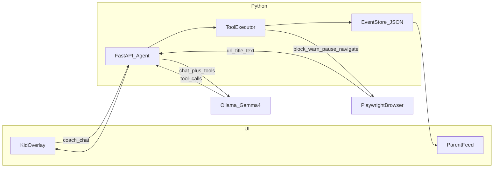

# KidGuard — 5-hour Hackathon Plan (Team of 4)

**Deadline:** today 18:00 (≈5h from now)  
**Track:** Autonomous Agents  
**Product:** KidGuard — patient internet guardian for ages 8–11 that explains risks, then acts via tools  
**Repo:** create `~/Python Projects/kidguard` (git + public GitHub before submit)  
**Locked stack:** Ollama (`gemma4` local) + FastAPI agent loop + Playwright browser + simple HTML UIs + local demo pages

Ollama is already on this machine (`/usr/local/bin/ollama`). Use it as the only Gemma runtime for the live demo.

**No SerpApi.** Safer alternatives = local demo URLs only.

---

## Goal by 18:00

Judges can watch this path without login:

1. Open controlled browser → OK page allowed
2. Clickbait page → Gemma calls `warn_kid` (overlay)
3. Fake phishing page → Gemma calls `block_page` + `notify_parent`
4. Second high-risk hit → `pause_session`
5. Optional 30s: kid asks to open Classroom → `navigate` on allowlist

Plus: public GitHub README, short demo recording, Kaggle Writeup (<1500 words, submitted).

---

## Architecture



**Gemma’s job:** given age + page context + policy, emit native tool calls.  
**App’s job:** execute tools for real (visible UI/browser changes), return results, show kid-facing copy.

---

## Repo layout (create once, then parallelize)

```text
kidguard/
  README.md
  requirements.txt
  .env.example                 # OLLAMA_HOST, MODEL=gemma4
  backend/
    main.py                    # FastAPI: /events, /decide, /coach, /state, /resume
    agent.py                   # Ollama chat + tool loop
    tools.py                   # allow/warn/block/pause/notify/navigate/suggest
    policy.py                  # system prompt + age rules
    store.py                   # events.json
  config/
    allowlist.py               # navigate allowlist + safer alternatives
  browser/
    session.py                 # Playwright launch, hooks on navigation
  demo_sites/
    ok_school.html
    clickbait.html
    phishing.html
    classroom.html             # allowlisted fake Classroom
  frontend/
    kid.html                   # overlay + chat
    parent.html                # live event feed
  scripts/
    demo.sh                    # one-command start
    smoke_decide.sh
    run_browser.sh
  writeup/
    KAGGLE_WRITEUP.md          # paste into Kaggle
    DEMO_SCRIPT.md
    BUGS.md
```

---

## Team roles (assign names at kickoff)

| Person | Role | Owns | Does not touch after sync |
|--------|------|------|---------------------------|
| **A** | Agent / Gemma | `backend/agent.py`, `policy.py`, tool schemas, Ollama client | frontend HTML, demo page copy |
| **B** | Browser / actions | `browser/session.py`, Playwright side-effects in `tools.py` | prompts, Kaggle prose |
| **C** | UI | `frontend/kid.html`, `frontend/parent.html`, overlay CSS/JS | Ollama internals |
| **D** | Platform + Coach + ship | `main.py`, `store.py`, `config/allowlist.py`, `demo_sites/*`, `/coach` wiring, `demo.sh`, README/writeup/GitHub/Kaggle | rewriting Gemma prompts (A owns) |

**D is a full-day builder**, not “submission-only.” Submission is their *last* block; until 16:30 they own the API shell, state/events, demo content, allowlist, coach feature, and continuous integration testing.

### Shared tool contract — freeze at 13:30 (do not rename)

- `allow_page()`
- `warn_kid(message, reason)`
- `block_page(reason, safer_alternative)`
- `pause_session(reason)`
- `notify_parent(summary)`
- `suggest_alternative(label, url)`
- `navigate(url)` — allowlist only

### API contract (D owns routes + store; A owns Gemma behind them)

- `POST /decide` `{url, title, text, age?}` → calls A’s agent → B’s tools → returns `{action, kid_message, events}`
- `POST /coach` `{message}` → D wires route; A’s agent decides; allowlist from D
- `GET /events` → parent feed JSON (D’s `store.py`)
- `GET /state` → `{paused, last_warning, last_block, last_kid_message}` (D)
- `POST /resume` → clear pause (D + B)

---

## Block 0 — 13:05–13:30 (everyone together)

Do in order, then split:

1. Assign A/B/C/D by name.
2. **D** creates GitHub repo + folder layout; everyone clones.
3. **D** creates venv + `requirements.txt` (`fastapi`, `uvicorn`, `httpx`, `pydantic`, `playwright`, `python-dotenv`) — A helps if needed.
4. **B** runs `playwright install chromium`.
5. **A** runs `ollama pull` for Gemma 4 instruct; pins `MODEL` in `.env`.
6. **A** proves one tool-call smoke test against Ollama (dummy `warn_kid`).
7. **D** announces demo URLs: `http://127.0.0.1:8765/ok_school.html` etc.
8. Read tool + API contract aloud once.

**Exit:** smoke tool-call works; repo cloned; roles clear.

---

## Person A — Agent / Gemma (step checklist)

### 13:30–14:30
1. Write `policy.py`: system prompt (guardian coach, kid language, always decide via a tool).
2. Define OpenAI-style `TOOLS` JSON list matching the frozen contract.
3. Write `agent.py`: Ollama `/api/chat` with `messages` + `tools`; parse `tool_calls`.
4. Implement loop: max 3 rounds; return structured result for D’s `/decide`.
5. Expose `run_guard(page_ctx, history) -> {tool_calls, kid_message}` for D to call — **do not own FastAPI**.
6. Unit-test with hardcoded phishing text → expect `block_page` / `warn_kid`.

### 14:30–15:30
1. Plug into D’s `/decide` (D hosts route; A provides function).
2. Pass last 3 events (from D’s store) into the prompt.
3. Truncate page `text` to ~1500 chars; keep generations short.
4. Log every tool call to console.
5. Pair with B 20 min until block/warn fires end-to-end.

### 15:30–16:30
1. Session risk counter in agent context → 2nd high-risk prefers `pause_session`.
2. Add `run_coach(message, allowlist) -> ...` for D’s `/coach`.
3. Clear errors if Ollama unreachable (raise typed error D maps to HTTP 503).
4. Unblock C on response fields if needed.

### 16:30–17:15
1. Freeze prompts; only fix tool-parse bugs.
2. Hand D 5 bullets: “How Gemma 4 is used” + tool-call log screenshot.

### 17:15–18:00
1. Stand by for model flakiness.
2. Pitch rehearsal once.

---

## Person B — Browser / actions (step checklist)

### 13:30–14:30
1. Write `browser/session.py`: launch Chromium (non-headless).
2. On navigation: extract `url`, `title`, text; `POST` D’s `/decide`.
3. Open D’s pages on `127.0.0.1:8765`.
4. Stub `tools.py` execute map (print-only OK).
5. Confirm phishing navigation hits `/decide` with text.

### 14:30–15:30
1. Make tools real against D’s store/state:
   - `warn_kid` / `block_page` / `pause_session` / `navigate` / `notify_parent` / `suggest_alternative` / `allow_page`
2. `block_page` uses D’s safer-alternative URLs.
3. `navigate` calls D’s `allowlist.is_allowed(url)` before `goto`.
4. Rehearse OK → clickbait → phishing with A+D.

### 15:30–16:30
1. Harden pause + `POST /resume` behavior with D.
2. Flake fixes: `domcontentloaded`, navigation races.
3. `scripts/run_browser.sh`.

### 16:30–17:15
1. Drive browser for D’s recording.
2. Fix crashers only.

### 17:15–18:00
1. Pre-open golden-path tabs for pitch.

---

## Person C — UI (step checklist)

### 13:30–14:30
1. `parent.html`: poll `GET /events` (mock until D’s store is up).
2. `kid.html`: status + chat → `POST /coach`.
3. Clear kid/parent visual language; no design rabbit hole.
4. Mock events so UI is demoable alone.

### 14:30–15:30
1. Wire live `/events` + `/state` from D.
2. Warning / blocked / paused overlays.
3. Show `last_kid_message`.
4. Verify parent feed updates during phishing test.

### 15:30–16:30
1. Coach chat UX + disable while paused.
2. “Gemma is thinking…” spinner.
3. Error toast on 503.
4. Demo layout: kid window + parent window.

### 16:30–17:15
1. First-10-seconds polish.
2. Screenshots for D’s writeup.
3. One dry-run with B.

### 17:15–18:00
1. Pre-load UIs; zoom for screen share.

---

## Person D — Platform + Coach + ship (step checklist)

D builds product code all afternoon; submission starts ~16:30.

### 13:30–14:30 — Platform foundation + demo content
1. Scaffold `backend/main.py` FastAPI app; run uvicorn on **8000**.
2. Implement `store.py`: append/list events (`events.json`).
3. Implement in-memory/JSON `state` (paused, last_warning, last_block, last_kid_message).
4. Routes: `GET /events`, `GET /state`, `POST /resume`; stub `POST /decide` calling A when ready.
5. Create `demo_sites/` (all four pages) + static server **8765**.
6. Add `config/allowlist.py` + default safer alternatives map.
7. Push repo skeleton to GitHub so others can pull.

### 14:30–15:30 — Glue the Guard path
1. Finish `/decide`: validate body → history from store → `agent.run_guard` → `tools.execute` → update state/events → response for B/C.
2. Tune demo page wording so classifications are reliable.
3. Seed safer alternatives (`phishing` → `ok_school.html` / `classroom.html`).
4. Write `scripts/smoke_decide.sh` (curl three pages’ text fixtures) — **D is integration owner**.
5. Sit in A+B integration; fix contract mismatches (field names, status codes).
6. Keep a running bug list in `writeup/BUGS.md`.

### 15:30–16:30 — Own the Coach feature + one-command demo
1. Implement `/coach` end-to-end (D owns this feature): parse kid message → `agent.run_coach` → allowlisted `navigate` via B’s tools → events (“Kid asked for help with Classroom”).
2. Age preset query param or config (`age=10`) respected in `/decide`.
3. Write `scripts/demo.sh`: start static server + API; print kid/parent/browser URLs.
4. Run full Guard path **twice alone**; file/fix breakages with A/B/C.
5. Draft README sections while waiting on model (architecture + run instructions).

### 16:30–17:15 — Submission pack (now D’s focus shifts)
1. Record 2–3 min demo (B drives browser, C has UIs open).
2. Finish README with A’s Gemma bullets + C screenshots.
3. Write `KAGGLE_WRITEUP.md` (<1500 words); paste + **Submit** on Kaggle.
4. Attach public GitHub + demo video; confirm no login wall.
5. Final push to `main`.

### 17:15–18:00 — Pitch lead
1. 60–90s pitch card; lead dry run.
2. Code freeze 17:30 except demo-breakers.
3. Verify Kaggle submission is submitted, not draft.

---

## Sync points (whole team, 5 minutes each)

| Time | Sync |
|------|------|
| **13:30** | Freeze tool + API names; D’s routes list confirmed |
| **14:30** | `/events` live? Browser hit `/decide`? |
| **15:30** | Full OK→warn→block→parent feed? |
| **16:30** | Coach works? `demo.sh` cold start? D switches to ship |
| **17:15** | Kaggle/GitHub/video status |
| **17:45** | Pitch dry run |

---

## Combined timeline (who does what when)

### 13:05–13:30 — Kickoff (all)
Repo, venv, Ollama smoke, assign A/B/C/D.

### 13:30–14:30 — Build in parallel
- **A** agent library · **B** browser capture · **C** UI mocks · **D** FastAPI+store+state+demo pages+allowlist

### 14:30–15:30 — Integrate Guard
- **A+B** tools · **C** live overlays · **D** `/decide` glue + smoke scripts + page tuning

### 15:30–16:30 — Coach + harden
- **A** pause logic + `run_coach` · **B** pause/navigate · **C** chat UX · **D** `/coach` feature + `demo.sh` + solo E2E

### 16:30–17:15 — Ship
- **A** Gemma bullets · **B** drive recording · **C** screenshots · **D** video + README + GitHub + Kaggle submit

### 17:15–18:00 — Buffer + pitch
All break-fix only; **D** leads pitch; freeze features

---

## How Gemma 4 is used (write this in README/Writeup)

1. **Input:** age=10, URL/title/text, last 3 events, browse|coach mode
2. **Native function calling** via Ollama `/api/chat` + `tools=[...]`
3. **Controller loop** in `agent.py` executes tools and feeds results back
4. **Outputs:** kid message (simple) + parent one-liner via `notify_parent`
5. **Privacy angle:** local Ollama — judgments stay on-device for the demo

Pitch line: *“KidGuard doesn’t surveil — Gemma decides, explains, and acts.”*

---

## Explicit non-goals (protect the clock)

- No SerpApi / live web search
- No real open-web crawling / production filter lists
- No accounts, auth, mobile app, cloud parent push
- No OS-wide monitoring
- No homework-writing tutor
- No second model / fine-tuning / RAG beyond page text + short history

---

## Submission checklist

- [ ] Kaggle Writeup submitted (title, subtitle, track = Autonomous Agents)
- [ ] Public GitHub link in Attachments
- [ ] Demo: hosted clip **or** clonable run path + video
- [ ] Gemma 4 clearly central (function calling visible in logs during demo)

---

## Risk controls

| Risk | Mitigation |
|------|------------|
| Model slow/flaky tools | Short context; enum-heavy tool args; rehearse 1 golden path; tiny deterministic fallback only for crash recovery |
| Playwright flaky | Fixed demo URLs on localhost; no real third-party sites in pitch |
| Integration hell at 15:00 | Shared tool contract frozen at T+30; one `main` branch; merge small |
| Scope creep | Hero = Guard path only; Coach is 30s teaser |
| Ollama model name mismatch | Pin `MODEL` in `.env` after first successful tool call |

---

## First commands after plan approval

1. Create project dir + git
2. Scaffold folders above
3. Verify `ollama list` / pull Gemma 4 + one tool-call smoke test
4. Assign A/B/C/D and start Block 1
